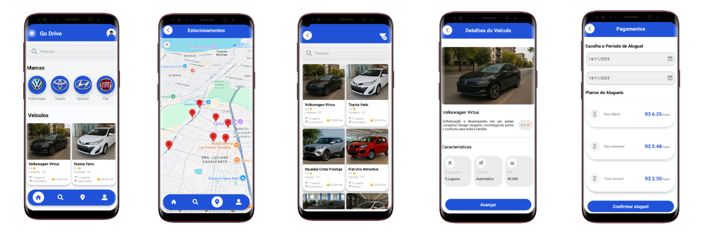
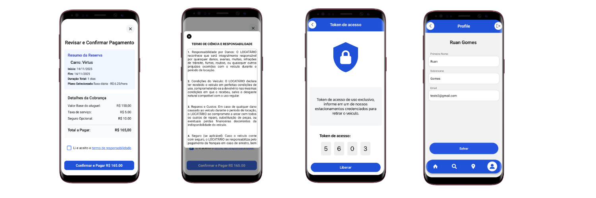

# 🚗 Go Drive

> Aplicativo mobile de aluguel de veículos desenvolvido com React Native e Expo.

## 📸 Screenshots






---

## 📋 Índice

- [Sobre o Projeto](#-sobre-o-projeto)
- [Funcionalidades](#-funcionalidades)
- [Tecnologias](#-tecnologias)
- [Pré-requisitos](#-pré-requisitos)
- [Instalação](#-instalação)
- [Configuração](#-configuração)
- [Executando o Projeto](#-executando-o-projeto)
- [Estrutura de Pastas](#-estrutura-de-pastas)
- [Build](#-build)
- [Arquitetura](#-arquitetura)
- [Contribuindo](#-contribuindo)
- [Licença](#-licença)
- [Contato](#-contato)

---

## 📖 Sobre o Projeto

O **Go Drive** é uma plataforma mobile que facilita o aluguel de veículos, permitindo que usuários:

- Explorem uma variedade de carros disponíveis
- Visualizem estacionamentos em tempo real através de mapas
- Realizem reservas de forma rápida e segura
- Efetuem pagamentos integrados
- Gerenciem seu perfil

---

## ✨ Funcionalidades

### 🔐 Autenticação

- Login com email e senha
- Cadastro multi-etapas com validação em tempo real
- Persistência de sessão com AsyncStorage

### 🚘 Exploração de Veículos

- Listagem completa de carros disponíveis
- Detalhes do veículo com carrossel de imagens
- Especificações técnicas e preços
- Sistema de busca e filtros

### 🗺️ Mapas e Localização

- Visualização de estacionamentos no mapa
- Geolocalização do usuário
- Navegação para destino via Google Maps
- Gerenciamento de permissões de localização

### 💳 Reserva e Pagamento

- Seleção de período de locação
- Cálculo automático de valores
- Integração com gateway de pagamento (Mercado Pago)
- Deep linking para confirmação de pagamento

### 👤 Perfil do Usuário

- Visualização e edição de dados pessoais

---

## 🛠 Tecnologias

- [React Native](https://reactnative.dev/) - Framework mobile
- [Expo](https://expo.dev/) - Plataforma de desenvolvimento
- [TypeScript](https://www.typescriptlang.org/) - Tipagem estática
- [React Hook Form](https://react-hook-form.com/) - Gerenciamento de formulários
- [Firebase](https://firebase.google.com/) - Backend (Auth + Firestore)
- [React Navigation](https://reactnavigation.org/) - Navegação
- [Expo Location](https://docs.expo.dev/versions/latest/sdk/location/) - Geolocalização
- [React Native Maps](https://github.com/react-native-maps/react-native-maps) - Mapas
- [Mercado Pago](https://www.mercadopago.com.br/developers) - Gateway de pagamento

---

## 📋 Pré-requisitos

- [Node.js](https://nodejs.org/) (versão 18 ou superior)
- [npm](https://www.npmjs.com/) ou [yarn](https://yarnpkg.com/)
- [Expo CLI](https://docs.expo.dev/get-started/installation/)
- [Expo Go](https://expo.dev/client) (para testar no dispositivo)
- Conta [Firebase](https://console.firebase.google.com/)
- API Key do [Google Maps](https://console.cloud.google.com/)
- Conta [Mercado Pago Developers](https://www.mercadopago.com.br/developers) (para pagamentos)

---

## 🚀 Instalação

```bash
# Clone o repositório
git clone https://github.com/PROJETOS-DE-GARAGEM/Go_drive.git

# Entre na pasta do projeto
cd Go_drive

# Instale as dependências
npm install
# ou
yarn install
```

---

## ⚙️ Configuração

### 1. **Variáveis de Ambiente**

Crie um arquivo `.env` na raiz do projeto:

```env
FIREBASE_API_KEY=sua_api_key
FIREBASE_AUTH_DOMAIN=seu_auth_domain
FIREBASE_PROJECT_ID=seu_project_id
FIREBASE_STORAGE_BUCKET=seu_storage_bucket
FIREBASE_MESSAGING_SENDER_ID=seu_sender_id
FIREBASE_APP_ID=seu_app_id
GOOGLE_MAPS_API_KEY=sua_google_maps_key
```

### 2. **Firebase**

- Crie um projeto no [Firebase Console](https://console.firebase.google.com/)
- Ative **Authentication** (Email/Password)
- Crie um banco de dados **Firestore**
- Adicione as credenciais no `.env`

### 3. **Google Maps API**

- Acesse [Google Cloud Console](https://console.cloud.google.com/)
- Crie um projeto e ative **Maps SDK for Android** e **Maps SDK for iOS**
- Gere uma API Key
- Configure no `app.json` e `eas.json`:

**app.json:**

```json
{
  "android": {
    "config": {
      "googleMaps": {
        "apiKey": "${GOOGLE_MAPS_API_KEY}"
      }
    }
  },
  "ios": {
    "config": {
      "googleMapsApiKey": "${GOOGLE_MAPS_API_KEY}"
    }
  }
}
```

**eas.json:**

```json
{
  "build": {
    "development": {
      "env": {
        "GOOGLE_MAPS_API_KEY": "sua_chave_aqui"
      }
    }
  }
}
```

### 4. **Mercado Pago (Opcional)**

Se for usar pagamentos:

- Crie uma conta no [Mercado Pago Developers](https://www.mercadopago.com.br/developers)
- Obtenha suas credenciais (Access Token)
- Configure no backend

---

## ▶️ Executando o Projeto

```bash
# Inicie o servidor de desenvolvimento
npx expo start
# ou
yarn start
```

### Opções de execução:

- Pressione `a` para abrir no **emulador Android**
- Pressione `i` para abrir no **emulador iOS**
- Escaneie o **QR Code** com o app Expo Go (Android) ou câmera nativa (iOS)

### ⚠️ Atenção para emuladores Android

O emulador não possui GPS real. Para testar localização:

1. Abra o painel do emulador (ícone `...`)
2. Vá em **Location**
3. Em **Single points**, defina coordenadas:
   - **Fortaleza**: Latitude `-3.7319`, Longitude `-38.5267`
   - **São Paulo**: Latitude `-23.5505`, Longitude `-46.6333`
4. Clique em **Set Location**
5. Reinicie o app

---

## 📁 Estrutura de Pastas

```
src/
├── components/          # Componentes reutilizáveis
│   ├── Form/           # Componente de formulário genérico
│   ├── Button/         # Botões customizados
│   ├── StepIndicator/ # Indicador de etapas
│   ├── Header/         # Cabeçalho de páginas
│   ├── PaymentModal/   # Modal de pagamento
│   └── ...
├── contexts/           # Contextos React
│   ├── AuthContext.tsx # Contexto de autenticação
│   └── RootProvider.tsx
├── hooks/              # Custom hooks
│   ├── useAuth.ts     # Hook de autenticação
│   ├── useHome.tsx    # Hook da home
│   └── useMap.tsx     # Hook de mapas
├── pages/              # Telas do aplicativo
│   ├── Login/         # Tela de login
│   ├── MultiForm/     # Cadastro multi-etapas
│   ├── Home/          # Dashboard
│   ├── FeedCars/      # Listagem de veículos
│   ├── DetailsCars/   # Detalhes do veículo
│   ├── Maps/          # Mapa de estacionamentos
│   ├── Profile/       # Perfil do usuário
│   ├── PaymentScreen/ # Tela de pagamento
│   ├── VehicleRelease/# Liberação de veículo
│   └── ...
├── routes/             # Configuração de navegação
│   ├── RootStack.tsx  # Stack principal
│   ├── AuthStack.tsx  # Rotas de autenticação
│   ├── AppStack.tsx   # Rotas do app
│   ├── TabBottom.tsx  # Navegação em abas
│   └── Linking.tsx    # Deep linking
├── services/           # Serviços e APIs
│   ├── AuthService.ts # Serviço de autenticação
│   ├── homeService.ts # Serviço de veículos
│   ├── mapsService.ts # Serviço de mapas
│   ├── paymentService.ts # Serviço de pagamento
│   └── ...
├── types/              # Tipos TypeScript
└── utils/              # Funções utilitárias
```

---

## 📦 Build

### Configurar EAS Build

```bash
# Instale o EAS CLI
npm install -g eas-cli

# Faça login
eas login

# Configure o projeto
eas build:configure
```

### Gerar Build Android (APK/AAB)

```bash
# Build de produção
eas build --platform android --profile production

# Build de desenvolvimento (para testar)
eas build --platform android --profile development
```

### Gerar Build iOS (IPA)

```bash
eas build --platform ios --profile production
```

### ⚠️ Importante para Google Maps no APK

Para o Google Maps funcionar no APK/AAB:

1. **Obtenha o SHA-1 do build:**

   - Acesse o painel do [Expo](https://expo.dev/accounts)
   - Veja o SHA-1 do build gerado

2. **Configure no Google Cloud Console:**

   - Acesse [Google Cloud Console](https://console.cloud.google.com/)
   - Vá em **APIs & Services > Credentials**
   - Selecione sua API Key
   - Em **Application restrictions**, escolha **Android apps**
   - Adicione o **package name** (`com.ads.godrive`) e o **SHA-1**

3. **Permissões de localização:**
   - Já estão configuradas no `app.json`
   - No APK, conceda permissões manualmente nas configurações do Android

---

## 🏗️ Arquitetura

### Gerenciamento de Estado

- **Contextos**: Estado global (autenticação, usuário)
- **Hooks**: Lógica de negócio reutilizável
- **React Hook Form**: Gerenciamento de formulários

### Formulário Multi-Etapas

O cadastro usa um formulário dividido em 3 etapas, gerenciado pelo **React Hook Form**:

```tsx
// FormProvider compartilha o contexto entre todas as etapas
<FormProvider {...methods}>
  {currentStep === 1 && <FormStepOne />}
  {currentStep === 2 && <FormStepTwo />}
  {currentStep === 3 && <FormStepThree />}
</FormProvider>
```

**Etapas:**

1. **FormStepOne**: Dados pessoais + endereço (busca automática por CEP)
2. **FormStepTwo**: Dados da CNH (categoria, número, datas)
3. **FormStepThree**: Credenciais de login (email e senha, com validação de unicidade)

**Validações:**

- Em tempo real usando `react-hook-form`
- Verifica unicidade de email e CPF no Firebase
- Valida formato de campos (CPF, email, datas, senha)
- Só permite avançar se a etapa atual for válida

### Autenticação

O `AuthContext` gerencia o estado de autenticação em toda a aplicação:

```tsx
const { user, signIn, signOut, loading } = useAuth();
```

**Funcionalidades:**

- Persistência com `AsyncStorage`
- Listener `onAuthStateChanged` do Firebase para sincronização em tempo real
- Proteção de rotas: usuário autenticado vê `AppStack`, não autenticado vê `AuthStack`

### Deep Linking

O app suporta deep links para retorno de pagamento:

- **Scheme:** `godrive://`
- **URL de retorno:** `godrive://checkout/congrats`
- Configurado em `Linking.tsx` e `app.json`

---

## 🎨 Padrões de Código

### Componentes

```
Component/
├── Component.tsx       # Lógica e estrutura
└── ComponentStyle.tsx  # Estilos (StyleSheet)
```

### Nomenclatura

- **Componentes**: PascalCase (`Button.tsx`)
- **Hooks**: camelCase com prefixo `use` (`useAuth.ts`)
- **Serviços**: camelCase com sufixo `Service` (`authService.ts`)
- **Contextos**: PascalCase com sufixo `Context` (`AuthContext.tsx`)

---

## 🧪 Testes

```bash
# Executar testes
npm test
# ou
yarn test
```

---

## 🤝 Contribuindo

Contribuições são sempre bem-vindas!

1. Faça um fork do projeto
2. Crie uma branch para sua feature (`git checkout -b feature/MinhaFeature`)
3. Commit suas mudanças (`git commit -m 'Adiciona MinhaFeature'`)
4. Push para a branch (`git push origin feature/MinhaFeature`)
5. Abra um Pull Request

---

## 📝 Licença

Este projeto está sob a licença MIT. Veja o arquivo LICENSE para mais detalhes.

---

## 👨‍💻 Autor

Desenvolvido por **Ruan Gomes e Railson Cosmo**

---

## 📞 Contato

Para dúvidas, sugestões ou feedback:

- GitHub: [@PROJETOS-DE-GARAGEM](https://github.com/PROJETOS-DE-GARAGEM)

---

⭐ Se este projeto foi útil para você, considere dar uma estrela!
